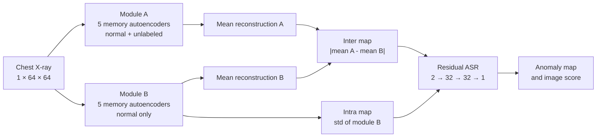

# ChestMem-AD: Memory-Guided Chest X-ray Anomaly Detection

A reproducible PyTorch project for chest X-ray anomaly detection using
dual-distribution discrepancy, a compact memory bank, and residual anomaly-score
refinement.

The repository contains a paper-compatible baseline, a verified RSNA
reproduction, ablation configurations, held-out evaluation tools, and the final
ChestMem-AD experiment. It is intended for research and education; its outputs
are not clinical diagnoses.

## Results

All results use the Med-AD v1 RSNA split. The paper-test column uses the same
1,000 normal + 1,000 abnormal test images as the original work. The independent
column uses another disjoint 1,000 + 1,000 images that were not used for
training or model selection.

| Method | Paper-test AUROC | Paper-test AP | Independent AUROC | Independent AP |
|---|---:|---:|---:|---:|
| Original paper, inter discrepancy | 0.815 | — | — | — |
| Reproduced paper model, inter | 0.8315 | 0.8204 | — | — |
| Memory-8 ensemble, inter (`pool=8`) | 0.8255 | 0.8222 | 0.8407 | 0.8333 |
| **Memory-8 + residual ASR** | **0.8373** | **0.8425** | **0.8574** | **0.8681** |

The independent ASR AUROC has a stratified bootstrap 95% confidence interval
of 0.8403–0.8728. Full experiment notes are in [TRAINING_LOG.md](TRAINING_LOG.md).

## Method

ChestMem-AD uses two reconstruction ensembles. Module A learns from the
known-normal set plus an unlabeled mixture, while module B learns only from
known-normal images. Each module contains five independently initialized
autoencoders. Their disagreement provides the anomaly signal.



### Memory autoencoder

The final configuration uses 64×64 grayscale input, a 128-dimensional latent
vector, eight learned memory prototypes, and no skip connections. Omitting
skips prevents the decoder from copying local abnormalities directly from the
encoder.

| Stage | Operation | Output shape |
|---|---|---|
| Input | normalized grayscale image | `1 × 64 × 64` |
| Encoder 1 | `Conv4×4/s2`, BatchNorm, LeakyReLU | `32 × 32 × 32` |
| Encoder 2 | `Conv4×4/s2`, BatchNorm, LeakyReLU | `64 × 16 × 16` |
| Encoder 3 | `Conv4×4/s2`, BatchNorm, LeakyReLU | `128 × 8 × 8` |
| Encoder 4 | `Conv4×4/s2`, BatchNorm, LeakyReLU | `256 × 4 × 4` |
| Bottleneck | flatten → 1024 → 128 | `128` |
| Memory | softmax attention over `8 × 128` prototypes | `128` |
| Decoder input | 128 → 1024 → 4096, reshape | `256 × 4 × 4` |
| Decoder 1 | transposed convolution + fusion block | `128 × 8 × 8` |
| Decoder 2 | transposed convolution + fusion block | `64 × 16 × 16` |
| Decoder 3 | transposed convolution + fusion block | `32 × 32 × 32` |
| Output | `ConvTranspose4×4/s2` | `1 × 64 × 64` |

One memory autoencoder has 10,234,816 trainable parameters. Training creates
five members for each module; inference therefore evaluates ten independently
trained autoencoders.

For latent vector `z` and prototype matrix `M`, the memory layer computes
`a = softmax(z Mᵀ)` and returns `z_mem = a M`. The optional entropy term
encourages concentrated prototype selection. The released Memory-8 setting
uses an entropy weight of `0.0002` and no hard-shrink threshold.

### Discrepancy maps and scores

Let `R_A` and `R_B` be the reconstruction stacks produced by the two
ensembles. The detector computes three maps:

- **Reconstruction:** squared error between the input and the mean of `R_B`.
- **Inter-discrepancy:** absolute difference between the means of `R_A` and
  `R_B`.
- **Intra-discrepancy:** pixelwise standard deviation among the five members
  of `R_B`.

For the raw Memory-8 result, 8×8 average pooling suppresses isolated pixel
noise before the spatial mean becomes the image-level score. Heatmaps are then
upsampled to the input resolution for display.

### Residual anomaly-score refinement

ASR keeps both reconstruction ensembles frozen. It receives the unpooled
inter- and intra-discrepancy maps as two input channels. Its three 3×3
convolutions have channel widths `2 → 32 → 32 → 1`, with BatchNorm and ReLU
after the first two layers. This refinement network has 10,209 trainable
parameters.

ASR predicts a residual correction to a monotonic transform of the raw inter
map, so the final output retains the original discrepancy evidence. Training
uses normal chest X-rays with randomly placed donor-image patch blends as
synthetic anomalies. A positive-weighted focal loss supervises the synthetic
patch mask. At inference, the sigmoid output is averaged spatially to produce
one anomaly score per image.

## Installation

Python 3.10+ and PyTorch 2.1+ are required.

```bash
python -m venv .venv
python -m pip install -e ".[dev]"
```

For DICOM preprocessing, install the optional dependency:

```bash
python -m pip install -e ".[dicom]"
```

## Dataset

The processed dataset is not included. The expected layout is:

```text
datasets/Med-AD_v1/RSNA/
├── data.json
└── images/
    ├── <patient-id>.png
    └── ...
```

The processed Med-AD benchmark is available through
[Zenodo](https://zenodo.org/records/12677223). Follow its academic-use terms.
The manifest must contain known-normal training images, normal/abnormal
unlabeled images, and normal/abnormal test images.

## Reproduce the paper baseline

```bash
chestmem-ad --config configs/rsna-paper.yaml train --module a
chestmem-ad --config configs/rsna-paper.yaml train --module b
chestmem-ad --config configs/rsna-paper.yaml evaluate
```

This configuration reproduces the paper architecture: 64×64 images, latent
size 16, three members per module, and 250 epochs.

## Train the Memory-8 model

```bash
chestmem-ad --config configs/rsna-noskip64-mem8.yaml train --module a
chestmem-ad --config configs/rsna-noskip64-mem8.yaml train --module b
chestmem-ad --config configs/rsna-noskip64-mem8.yaml evaluate
```

If the package is not installed, prefix commands with `PYTHONPATH=src` and use
`python main.py` instead of `chestmem-ad`.

## Held-out evaluation and ASR

Create a deterministic held-out split and save per-image scores:

```bash
python scripts/heldout_eval.py configs/rsna-noskip64-mem8.yaml \
  --count 1000 --seed 2026
```

Train residual ASR while keeping all reconstruction models frozen:

```bash
python scripts/train_asr.py configs/rsna-noskip64-mem8.yaml \
  --epochs 20 --max-batches 32 --batch-size 128
```

Render input, raw discrepancies, and refined maps:

```bash
python scripts/render_asr.py configs/rsna-noskip64-mem8.yaml --count 8
```

Generated datasets, checkpoints, metrics, and visualizations are written under
`datasets/` and `outputs/`; both directories are ignored by Git.

## Repository structure

```text
configs/          experiment configurations and ablations
scripts/          evaluation, conversion, analysis, and rendering utilities
src/chestmem_ad/  maintained training and inference package
tests/            CPU synthetic-data smoke tests
TRAINING_LOG.md   complete experiment record and decisions
```

## Verification

```bash
python -m pytest -q
```

The smoke test builds a synthetic dataset, trains both modules on CPU, reloads
their checkpoints, and verifies all anomaly scores.

## Limitations

- Image-level anomaly detection has been independently validated; pixel-level
  localization has not been measured because the Med-AD archive does not
  include the original RSNA bounding-box CSV.
- Extreme framing differences, black borders, and unusually small radiographs
  can produce false positives.
- The 128×128 and unrestricted skip-connection experiments did not improve
  detection and are retained only as ablations.
